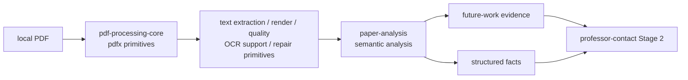
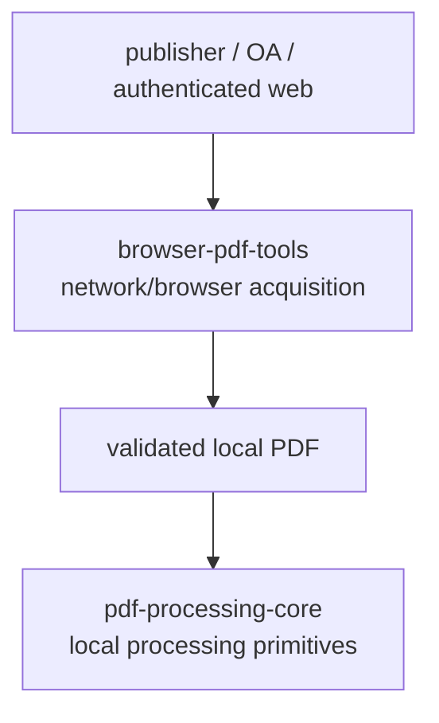

# pdf-processing-core

`pdf-processing-core` 提供 ScholarWorkflow 共享的 **PDF / OCR / quality / formula / source-repair primitives**。Python distribution 为 `pdf-processing-core`，CLI 为 `pdfx`；它不负责浏览器下载、Zotero、论文语义分析或 professor-contact 状态机。

当前 APM target 为 `opencode` 与 `codex`；Python 包依赖 `PyMuPDF>=1.24`。

## 在论文分析链中的位置

`pdf-processing-core` 不决定论文与教授方向的关系、不生成 gap、不写 `_resolved_directions.json` 或 `套磁候选输入.json`。这些语义属于调用方。

## 与浏览器 PDF 下载的边界

Chrome/CDP、登录态、VPN/campus access、站点反爬等属于 `browser-pdf-tools`/宿主 runtime；本仓不拥有这些能力。反过来，浏览器下载层也不应复制 `pdfx` 的本地 PDF quality/processing 实现。

## 调用原则

- 调用方应通过发布的 distribution/API 或受管 helper 使用 `pdfx`，不要依赖本仓 checkout 内部目录布局。
- `paper-analysis` 的 full-mode helper 负责把本地 PDF 处理结果接入 future-work / facts 的语义验证；本仓只提供底层 deterministic primitives。
- OCR 的模型/视觉调用策略属于上层 skill/agent；本仓只承载可确定性的 PDF/OCR 辅助能力。

精确 API、CLI 与修复规则以本仓源码和测试为准；套磁 workflow 的 Stage 2 authority 以 `ScholarWorkflow/professor-contact` 当前 workflow reference 为准。